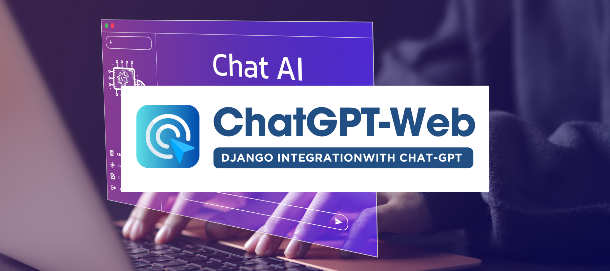

# Django ChatGPT Integration

Django ChatGPT Integration is a web application that combines the power of Django, a robust web framework, with ChatGPT, an AI language model developed by OpenAI. This application allows users to interact with an AI-powered chatbot through a user-friendly chat interface.

## Key Features

- User-friendly chat interface for interacting with the chatbot.
- Seamless integration with ChatGPT APIs for intelligent conversational capabilities.
- User registration and authentication for personalized chatbot experiences.
- Conversation history storage and display for easy reference to previous interactions.
- Real-time communication using AJAX requests.
- Error handling to manage API communication errors.

## Installation

Follow these steps to set up and run the Django ChatGPT Integration project:

1. Clone the repository:

   ```shell
   git clone https://github.com/Ansarimajid/DjangoChatgpt.git
   ```

2. Navigate to the project directory:

   ```shell
   cd django_chatbot
   ```

3. Install the project dependencies using pip:

   ```shell
   pip install -r requirements.txt
   ```

4. Set up the necessary configurations:
   
     ```
     OPENAI_API_KEY=your-api-key
     ```

5. Apply database migrations:

   ```shell
   python manage.py migrate
   ```

6. Run the Django development server:

   ```shell
   python manage.py runserver
   ```

7. Access the application in your web browser by visiting `http://localhost:8000`.

## Usage

1. Create an account or log in to your existing account.
2. In the chat interface, type your message in the input field and click "Send" to receive a response from the chatbot.
3. Chat with the chatbot and explore its capabilities.
4. View the conversation history on the screen.

## Contributing

Contributions to the Django ChatGPT Integration project are welcome! If you encounter any issues or have suggestions for improvements, please feel free to submit a pull request or open an issue in the GitHub repository.

## License

This project is licensed under the [MIT License](LICENSE).

## Acknowledgements

- [Django](https://www.djangoproject.com/) - Web framework used for building the application.
- [ChatGPT](https://openai.com/) - AI language model for generating chatbot responses.


